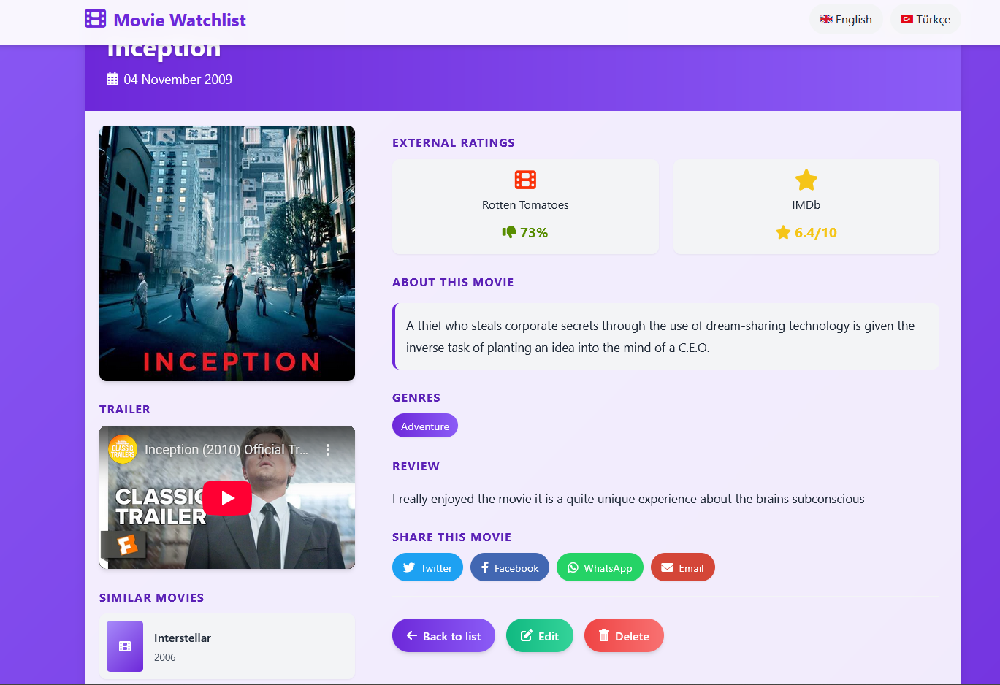
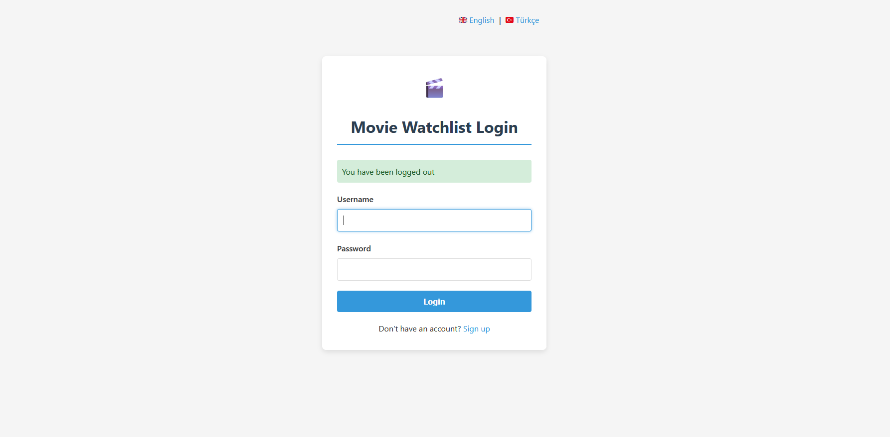

# Movie-watchlistWebapp

A sophisticated web application for keeping track of your favorite movies, with a focus on personal ratings, reviews, and rich movie information.

## 📋 Features

- **Movie Management**: Add, edit, and delete movies in your personal collection
- **Rating System**: Rate movies on a scale of 1-10 with an intuitive star rating interface
- **Personal Reviews**: Write and save your thoughts about each movie
- **Rich Movie Details**: View extensive information including:
  - Cast and director information
  - Movie duration
  - Genre classification
  - Movie descriptions
  - External ratings (IMDb, Rotten Tomatoes)
- **Trailer Integration**: Watch movie trailers directly within the app
- **Similar Movies**: Get personalized movie recommendations based on your collection
- **Multi-language Support**: Full support for English and Turkish languages
- **Responsive Design**: Works seamlessly on desktop and mobile devices
- **Social Sharing**: Share your favorite movies via Twitter, Facebook, WhatsApp, and email

## 🖼️ Screenshots

<!-- Add your screenshots here. For example: -->

### Movie List Page

*Browse your entire movie collection with quick filtering options*

### Movie Details Page

*Rich movie information including trailer, cast, ratings, and similar movie recommendations*

### Add/Edit Movie Form

*Intuitive form to add new movies or update existing entries*

## 🛠️ Technologies

- **Backend**: Java Spring Boot
- **Frontend**: HTML5, CSS3, JavaScript
- **Templates**: Thymeleaf for server-side rendering
- **Styling**: Custom CSS with responsive design
- **Integration**: YouTube API for movie trailers
- **Database**: Spring Data JPA with your preferred database

## ⚙️ Setup and Installation

1. Clone the repository:
```bash
git clone https://github.com/AliSalih-ops/Movie-watchlistWebapp.git
```
2.Navigate to the project directory:
```bash
cd Movie-watchlistWebapp
```
3.Build the project:
```bash
./mvnw clean install
```
4.Run the application:
```bash
./mvnw spring-boot:run
```
5.Access the application at:
```bash
http://localhost:8080
```

   🌐 Localization
The application supports both English and Turkish languages. You can switch between languages using the language selector in the navigation bar.
📱 Mobile Support
The application is fully responsive and works on all device sizes.
📝 Future Enhancements

User authentication and personal movie collections
Advanced filtering and sorting options
Integration with external movie databases
Public sharing of movie reviews
Machine learning recommendations

📄 License
This project is licensed under the MIT License - see the LICENSE file for details.

Feel free to contribute to this project by submitting issues or pull requests!
   
